# 실제 시험 기출 문제

## 문제 1
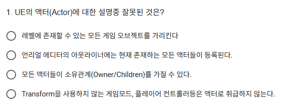

## 문제 2
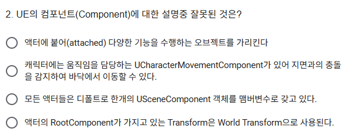

## 문제 3
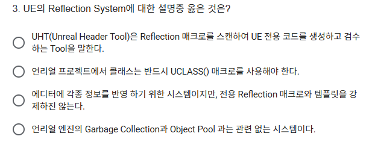

## 문제 4
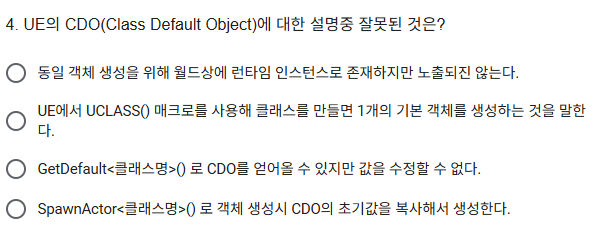

## 문제 5
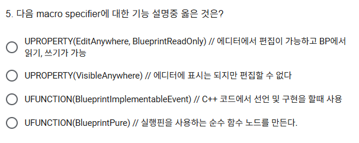

## 문제 6
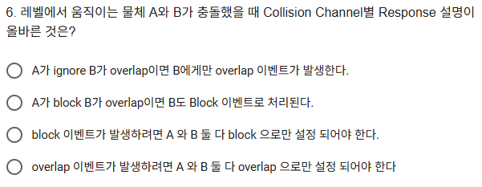

## 문제 7
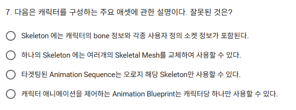

## 문제 8
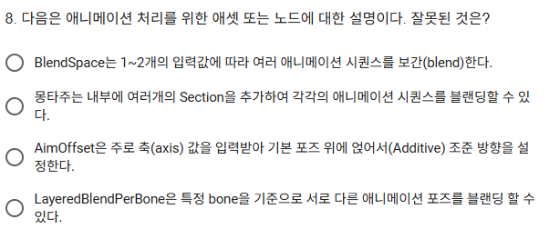

## 문제 9
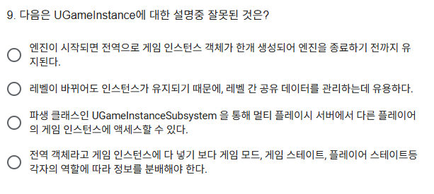

## 문제 10
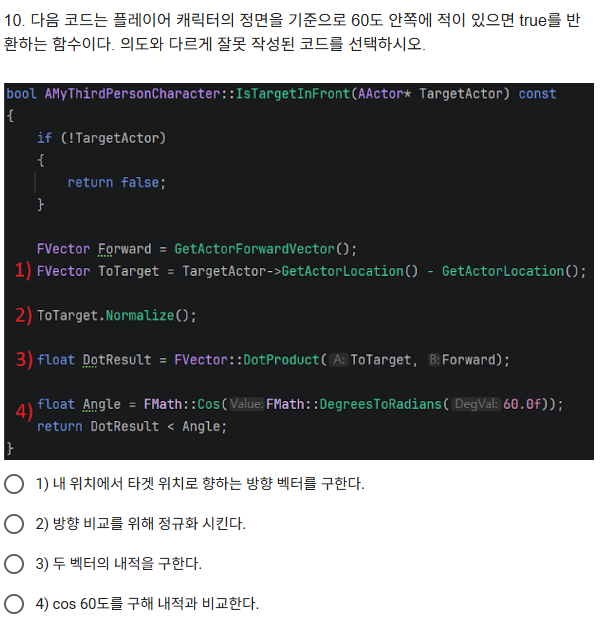

## 문제 11
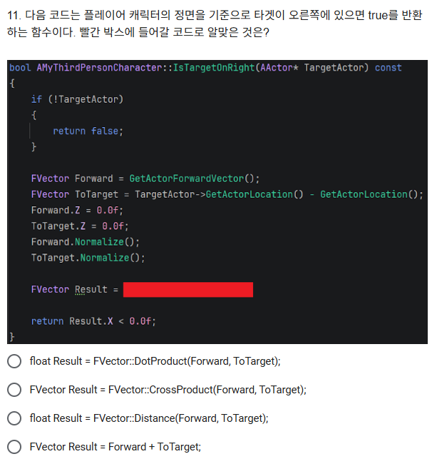

## 문제 12
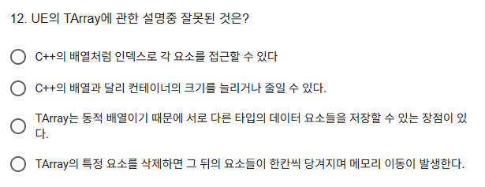

## 문제 13
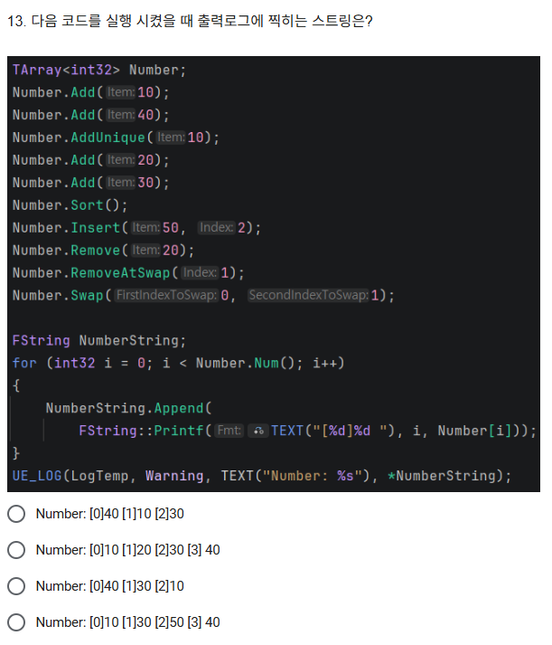

## 문제 14
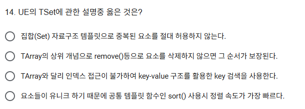

## 문제 15
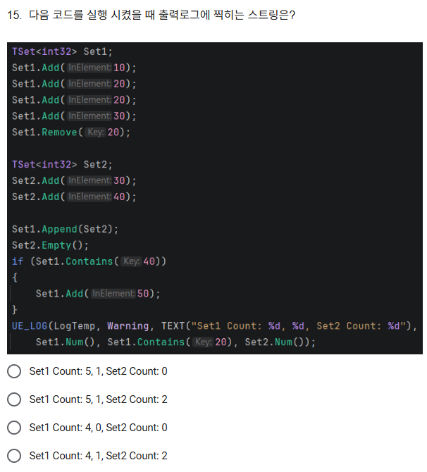

## 문제 16
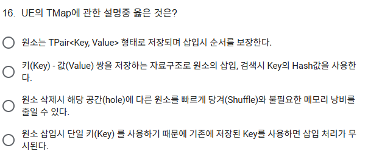

## 문제 17
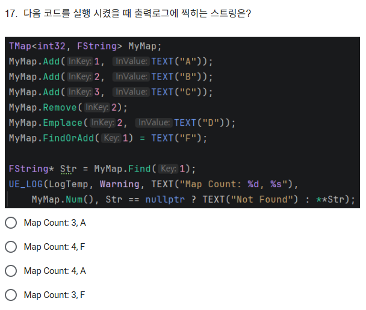

## 문제 18
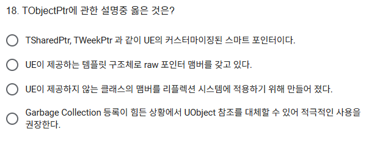

## 문제 19
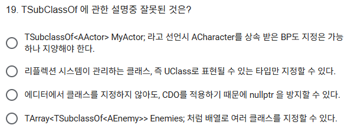

## 문제 20
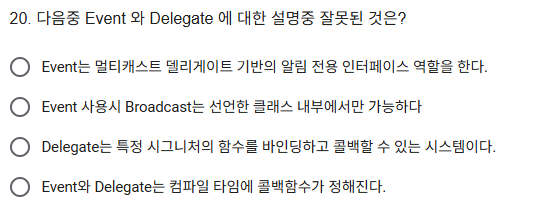

      

---
# 정답 및 해설

### 문제 1 정답: 4번
**해설:** 게임 모드(`AGameModeBase`), 플레이어 컨트롤러(`APlayerController`), 게임 스테이트(`AGameStateBase`) 등은 화면에 보이지 않고 위치나 크기(Transform) 정보가 무의미하지만, 모두 `AActor`를 상속받은 엄연한 **액터(Actor)**입니다. (이들은 주로 내부적으로 `AInfo` 클래스를 상속받아 불필요한 렌더링/콜리전 컴포넌트를 갖지 않습니다.)

### 문제 2 정답: 3번
**해설:** 모든 액터가 기본적으로 `USceneComponent`를 가지는 것은 아닙니다. `AActor`는 `RootComponent` 포인터를 가지지만, 생성자에서 명시적으로 `USceneComponent`(또는 그 파생 클래스)를 생성하여 할당하지 않으면 `nullptr`로 남아있습니다. 예를 들어 `AInfo` 클래스는 씬 컴포넌트를 가지지 않습니다.

### 문제 3 정답: 1번
**해설:** UHT(Unreal Header Tool)는 언리얼 엔진 빌드 과정에서 C++ 헤더 파일의 `UCLASS`, `UPROPERTY`, `UFUNCTION` 등의 리플렉션 매크로를 스캔하여 `.generated.h` 와 `.gen.cpp` 파일을 생성해 리플렉션 데이터를 구성하는 도구입니다. 언리얼에서 일반 C++ 클래스를 만들 때는 `UCLASS()` 매크로를 쓰지 않아도 되며, 가비지 컬렉션은 리플렉션 시스템에 전적으로 의존합니다.

### 문제 4 정답: 1번
**해설:** CDO(Class Default Object)는 월드(레벨)에 인스턴스화되는 액터가 아닙니다. 엔진 초기화 시점에 클래스당 단 하나씩 메모리(엔진 패키지)에 생성되어 기본값을 저장하는 원본(템플릿) 역할을 하며, 게임 월드의 트랜스폼을 가지고 배치되는 것이 아닙니다.

### 문제 5 정답: 2번
**해설:** `VisibleAnywhere`는 에디터(디테일 패널)에서 속성 값을 볼 수는 있지만 수정할 수는 없게 만듭니다. `EditAnywhere`와 `BlueprintReadOnly`를 같이 쓰면 에디터에서는 편집 가능하지만 블루프린트 노드에서는 Get만 가능합니다. `BlueprintImplementableEvent`는 C++에서 선언만 하고 구현은 블루프린트에서 하는 이벤트입니다.

### 문제 6 정답: 3번
**해설:** 언리얼 콜리전 시스템에서 물리적 `Block`이 발생하려면 충돌하는 두 물체(A와 B) **모두 상대방의 콜리전 채널에 대해 `Block` 응답을 설정**해야 합니다. 한 쪽이라도 `Overlap`이나 `Ignore`라면 물리적인 `Block`은 발생하지 않습니다.

### 문제 7 정답: 4번
**해설:** 캐릭터(또는 스켈레탈 메시) 하나에 대해 여러 개의 애니메이션 블루프린트(Animation Blueprint)를 교체해 가며 사용하거나, 서브 애니메이션 인스턴스(Sub Anim Instance), 링크드 애니메이션 레이어(Linked Anim Layer) 등을 통해 여러 개를 조합하여 복합적으로 사용할 수 있습니다.

### 문제 8 정답: 2번
**해설:** 애니메이션 몽타주(Montage)는 여러 애니메이션 시퀀스를 섹션(Section)으로 나누어 순차적으로 재생하거나 조건에 따라 특정 섹션으로 점프하는 등 '시퀀싱(Sequencing)'을 위한 에셋입니다. BlendSpace처럼 입력값(Axis)에 따라 여러 애니메이션을 하나로 '블렌딩(보간)'하는 역할을 하는 것이 아닙니다.

### 문제 9 정답: 3번
**해설:** `UGameInstance`는 게임 프로세스(클라이언트 또는 데디케이티드 서버)당 하나씩만 존재하는 로컬 전역 객체입니다. 멀티플레이 시 클라이언트는 네트워크를 통해 서버나 다른 플레이어의 `UGameInstance`에 접근할 수 없습니다.

### 문제 10 정답: 4번
**해설:** 두 벡터의 내적(DotProduct) 결과는 두 벡터 사이 각도의 `Cos` 값입니다. 각도가 작을수록(0도에 가까울수록) 내적 값은 커집니다. (예: cos(0) = 1.0, cos(60) = 0.5). 따라서 타겟이 60도 "안쪽"에 있다면 내적 결과가 cos(60) 값보다 **커야** 합니다. `return DotResult > Angle;` 이 올바른 코드입니다.

### 문제 11 정답: 2번
**해설:** 왼쪽/오른쪽을 판별할 때는 두 벡터의 **외적(CrossProduct)**을 사용합니다. 언리얼의 좌향(Left-handed) 좌표계에서 전방 벡터(Forward)와 타겟 벡터(ToTarget)를 외적하면, 타겟이 어느 쪽에 있는지에 따라 결과 벡터의 Z축 부호(+/-)가 달라집니다. (내적은 앞/뒤 판별, 외적은 좌/우 판별에 유용합니다.)

### 문제 12 정답: 3번
**해설:** `TArray`는 C++의 `std::vector`와 마찬가지로 **단일 타입(동종)**의 데이터만 저장할 수 있는 동적 배열 템플릿입니다. 서로 다른 타입의 데이터를 하나의 `TArray`에 섞어서 저장할 수 없습니다.

### 문제 13 정답: 1번
**해설:** 
- Add(10), Add(40) -> `[10, 40]`
- AddUnique(10) -> (추가 안 됨) -> `[10, 40]`
- Add(20), Add(30) -> `[10, 40, 20, 30]`
- Sort() -> `[10, 20, 30, 40]`
- Insert(50, 2) -> `[10, 20, 50, 30, 40]`
- Remove(20) -> `[10, 50, 30, 40]`
- RemoveAtSwap(1) -> 1번(50) 삭제 후 맨 끝 원소(40)로 자리 메꿈 -> `[10, 40, 30]`
- Swap(0, 1) -> 0번과 1번 교환 -> `[40, 10, 30]`

### 문제 14 정답: 1번
**해설:** `TSet`은 수학의 집합과 같이 데이터의 중복을 허용하지 않는 자료구조입니다. 내부적으로 해시를 사용하여 순서를 보장하지 않으며(2번 틀림), Key-Value 쌍이 아닌 Key 단일 원소를 관리하고(3번 틀림), 순서가 없는 구조이므로 `Sort()` 사용이 주 목적이 아닙니다(4번 틀림).

### 문제 15 정답: 3번
**해설:** 
- `Set1`에 10, 20, 20, 30을 Add -> 중복 제거되어 `{10, 20, 30}` -> Remove(20) -> `{10, 30}`
- `Set2`에 30, 40을 Add -> `{30, 40}`
- `Set1.Append(Set2)` -> `{10, 30, 40}` (Count: 3)
- `Set2.Empty()` -> Set2는 0개
- `Set1.Contains(40)`이 참이므로 `Set1.Add(50)` 실행 -> Set1은 `{10, 30, 40, 50}` (Count: 4)
- 출력 결과: Set1 Count는 4, Set1.Contains(20)은 0(false), Set2 Count는 0.

### 문제 16 정답: 2번
**해설:** `TMap`은 Key-Value 쌍을 다루며, Key의 해시(Hash)값을 이용해 O(1)의 빠른 속도로 요소를 검색/삽입하는 자료구조입니다. 삽입 순서를 보장하지 않으며(1번 틀림), 원소 삭제 시 남은 빈자리(hole)를 당겨서 채우지 않고(Shuffle 안함) 그대로 두어 빠른 삭제 속도를 보장합니다(3번 틀림). 이미 존재하는 Key를 `Add`하면 기존 Value를 새 Value로 덮어씌웁니다(4번 틀림).

### 문제 17 정답: 4번
**해설:** 
- 1:"A", 2:"B", 3:"C" 추가
- Remove(2) -> 2번 키 삭제
- Emplace(2, "D") -> 2:"D" 로 재추가
- FindOrAdd(1) = "F" -> 1번 키가 이미 있으므로 "A"를 "F"로 덮어씌움
- Map 상태: `{1:"F", 3:"C", 2:"D"}` (총 3개)
- `Find(1)`은 "F"를 가리킵니다. 따라서 Map Count: 3, 문자열은 "F"가 출력됩니다.

### 문제 18 정답: 2번
**해설:** `TObjectPtr<T>`는 언리얼 엔진 5부터 도입된 템플릿 구조체로, 내부에 UObject의 원시(raw) 포인터를 감싸고 있습니다. 에디터 빌드에서는 동적 해석(Lazy Load) 등 여러 추가 기능을 제공하지만, 런타임(게임 배포) 빌드에서는 일반 raw 포인터와 동일하게 매우 가벼운 비용으로 동작합니다. 가비지 컬렉션을 위해 반드시 `UPROPERTY()` 매크로와 함께 써야 합니다.

### 문제 19 정답: 3번
**해설:** `TSubclassOf`로 선언된 변수라 할지라도 에디터나 C++ 코드에서 특정 클래스(UClass)를 명시적으로 할당해주지 않으면 기본값은 `nullptr`입니다. 따라서 런타임에서 안전하게 사용하려면 접근하기 전에 `nullptr` 체크(또는 `IsValid()`)를 반드시 해야 합니다.

### 문제 20 정답: 4번
**해설:** Event와 Delegate(델리게이트) 모두 **런타임(프로그램 실행 중)**에 동적으로 특정 객체의 함수를 바인딩(연결)하고 해제할 수 있는 콜백 시스템입니다. 컴파일 타임에 정적으로 호출 대상이 정해지는 것이 아닙니다.
